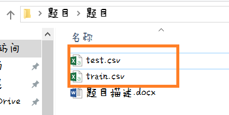

#第二届“大数据月”算法比赛

@(预测银行顾客排队离队率)

### 题目描述：
银行排队系统也称之为银行排队机、叫号显示系统。

       随着电子信息产品、智能产品的快速发展，以及人类生活对服务环境、服务效率的要求越来越高，尤其是在服务性行业里更是如此，因此排队系统这个概念就应运而生了。但是在一些落后的地区，没有先进的系统支持，人们还在为了排队而烦恼。有时候看到银行门口长长的队伍，许多人就直接放弃了等待。这看似普通的现象，背后却蕴含着大量有迹可循的大道理！！！聪明的你可能会说，当一个顾客刚刚走进银行的时候，你就已经知道了他会离开所在队伍的可能性，从而选对正确的队列，减少等待。预测数据并不是凭空猜测，你肯定也需要一些数据作为你预测的佐证。
：
 
### 下面是为本次比赛准备的数据：
数据以CSV文件格式下发，每一行代表影响每一位顾客是否离开的相关信息。
-  数据分别存在两个文件：
- 第一个文件是训练集（train.csv，共2500行），用于训练你的算法或计算模型。包括八个特征和一个结果（即顾客离队率）。
- 第二个文件是测试集（test.csv，共500行），用于预测得出你本次比赛的结果。包括八个特征。
你计算出来的结果，即顾客离队率。（这是你要提交给我们的答案）

### 数据示例：
- 

- 八个特征即绿色框线部分，可以理解为会影响顾客离队率的八个因素。
就好像，你小时候是否经常喝牛奶和你长大后身高超过180cm的可能性。是否常喝牛奶就是影响你身高的一个因素，即一个特征值。
- 一个结果即红色框线部分，为顾客离队率。
具体每一列的值的含义如下：

### 提交结果：
 来自可爱的学长学姐的提醒：必须按照下列要求提交答案，否则视作无效的提交。后果自负。
我们要求你所提交的答 案文件，为CSV文件。即文件后缀名为.csv。如： 

  
文件内容为按序排列，即你的文件的第一行数据，对应测试集的第一行的答案。请不要有任何的多余内容（甚至是空格）。如：

### 做题要求：
你可以使用任何一种编程语言来编写算法或程序。
### 判分标准：
本次比赛考查的是回归问题。此次采用了numpy库中的相关系数corrcoef(yEstimate,yActual)来计算你提交的结果和答案的相关性，作为评分的标准。

 **最终成绩 = 椭圆内的部分 * 100**
